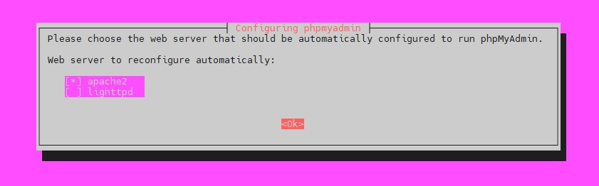
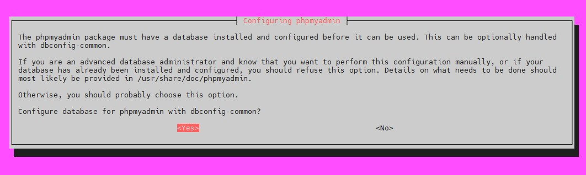
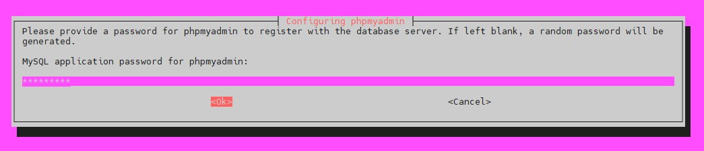

## Install phpMyAdmin on Ubuntu 20.04: 
To install phpMyAdmin on Ubuntu 20.04, you can follow these steps:

### Prerequisite: 
- Install Apache
- Install PHP
- Install MySQL


### Install Mysql: 
```
sudo apt install mysql-server -y
```


```
mysql --version
```


```
vim /etc/mysql/mysql.conf.d/mysqld.cnf

[mysqld]

user            = mysql
bind-address    = 0.0.0.0

save and quit
```


```
sudo systemctl start mysql
sudo systemctl status mysql
```

```
netstat -tlpn | grep 3306
```


```
sudo mysql

ALTER USER 'root'@'localhost' IDENTIFIED WITH mysql_native_password BY 'password';
FLUSH PRIVILEGES;
exit
```


```
sudo mysql_secure_installation

    Securing the MySQL server deployment.
    Enter password for user root: ******
```


```
mysql -u root -p
ALTER USER 'root'@'localhost' IDENTIFIED WITH auth_socket;
```


```
SELECT user,authentication_string,plugin,host FROM mysql.user;
SELECT user,host FROM mysql.user;
```


```
UPDATE mysql.user SET host='%' WHERE user='root';
FLUSH PRIVILEGES;
```


### Install phpMyAdmin: 

```
sudo apt update

### Must be install for phpMyAdmin:
sudo apt install -y php7.4-mysql php7.4-mbstring php7.4-gd php7.4-xml php7.4-curl -y
sudo apt install -y php8.2-mysql php8.2-mbstring php8.2-gd php8.2-xml php8.2-curl -y

sudo apt install -y phpmyadmin libapache2-mod-php
```

1. The installer prompts you to choose a web server to configure automatically. The apache2 option is already highlighted if the system uses Apache. Press **Spacebar** to select **apache2**, then press **Tab** to highlight **Ok**. Then press Enter to confirm the selection.

- [*] apache2 -> OK
- [Yes]
- MYSQL application password for phpmyadmin: admin123 -> OK
- Password confirmation: admin123 -> OK





2. (Optional) Select **Yes** and press Enter to set up a phpMyAdmin database using the dbconfig-common configuration package.




3. The installer creates a default user named phpmyadmin. Type a strong password for the phpmyadmin user and hit Enter.



4. Confirm the password and press Enter.


```
ll /etc/phpmyadmin/apache.conf
ll /usr/share/phpmyadmin
```


5. Databases access: 
Assign appropriate privileges to the new user. For example:

```
CREATE USER 'user1'@'localhost' IDENTIFIED WITH mysql_native_password BY 'admin123';

GRANT ALL PRIVILEGES ON *.* TO 'user1'@'localhost' WITH GRANT OPTION;

FLUSH PRIVILEGES;
```


6. Open a browser and access the phpMyAdmin login page by entering: **your_ip/phpmyadmin**

That's it! You have successfully installed phpMyAdmin on Ubuntu 20.04.


---
---


### Install phpMyAdmin on Centos-7: 
To install phpMyAdmin on CentOS 7, you can follow these steps:


### Prerequisite: 
- Install httpd
- Install PHP
- Install MySQL


### Install Mysql: 


```
sudo yum install epel-release
```

```
### Download and install the MySQL repository package:

sudo yum install -y https://dev.mysql.com/get/mysql80-community-release-el7-10.noarch.rpm  

or,

wget https://repo.mysql.com/mysql80-community-release-el7-1.noarch.rpm

yum localinstall mysql80-community-release-el7-1.noarch.rpm
```


```
### Enable MySQL Yum Repository:

sudo yum-config-manager --enable mysql80-community 

sudo yum repolist enabled | grep "mysql.*-community.*"
```


```
### Install MySQL:

sudo yum install -y mysql-community-server 
```


```
mysql --version
```


```
sudo vim /etc/my.cnf

[mysqld]

bind-address    = 0.0.0.0

save and quit
```


```
sudo systemctl start mysqld 
sudo systemctl status mysqld 
```


### Secure MySQL Installation:
MySQL version 8.0 or higher generates a temporary random password in /var/log/mysqld.log after installation.

```
grep 'temporary password' /var/log/mysqld.log
```


```
mysql -u root -p

Enter password: <temporary password>
```


```
ALTER USER 'root'@'localhost' IDENTIFIED WITH mysql_native_password BY 'Adm1n@24';
FLUSH PRIVILEGES;
exit
```


```
sudo mysql_secure_installation

    Securing the MySQL server deployment.
    Enter password for user root: Adm1n@24

The 'validate_password' component is installed on the server.
The subsequent steps will run with the existing configuration of the component.
Using existing password for root.
...
...
```


```
mysql -u root -p
```


```
### To uninstall:

sudo yum remove -y mysql-community-server
```


```
sudo rm -rf /etc/my.cnf
sudo rm -rf /var/lib/mysql
```

### Install phpMyAdmin: 


```
sudo yum install -y phpMyAdmin
```


These lines are repeated, so you will need to change four lines in total. Change the IP address 127.0.0.1 to your IP address. Then save and exit the file.

Require ip 127.0.0.1 

Allow from 127.0.0.1


```
ll /usr/share/phpMyAdmin
```


```
vim /etc/httpd/conf.d/phpMyAdmin.conf

Alias /phpMyAdmin /usr/share/phpMyAdmin
Alias /phpmyadmin /usr/share/phpMyAdmin

<Directory /usr/share/phpMyAdmin/>
   AddDefaultCharset UTF-8

   <IfModule mod_authz_core.c>
     # Apache 2.4
     <RequireAny>
       Require ip 192.168.10.44
       Require ip ::1
     </RequireAny>
   </IfModule>

   <IfModule !mod_authz_core.c>
     # Apache 2.2
     Order Deny,Allow
     Deny from All
     Allow from 192.168.10.44
     Allow from ::1
   </IfModule>
</Directory>

<Directory /usr/share/phpMyAdmin/setup/>
   <IfModule mod_authz_core.c>
     # Apache 2.4
     <RequireAny>
       Require ip 192.168.10.44
       Require ip ::1
     </RequireAny>
   </IfModule>

   <IfModule !mod_authz_core.c>
     # Apache 2.2
     Order Deny,Allow
     Deny from All
     Allow from 192.168.10.44
     Allow from ::1
   </IfModule>
</Directory>
...
...


save and quit
```


```
sudo systemctl restart httpd
sudo systemctl status httpd
```

Now you can access phpMyAdmin using the URL: **your_ip/phpmyadmin**


